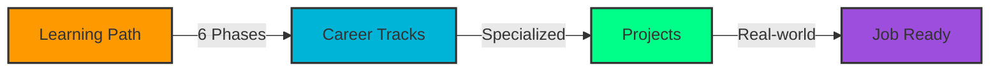
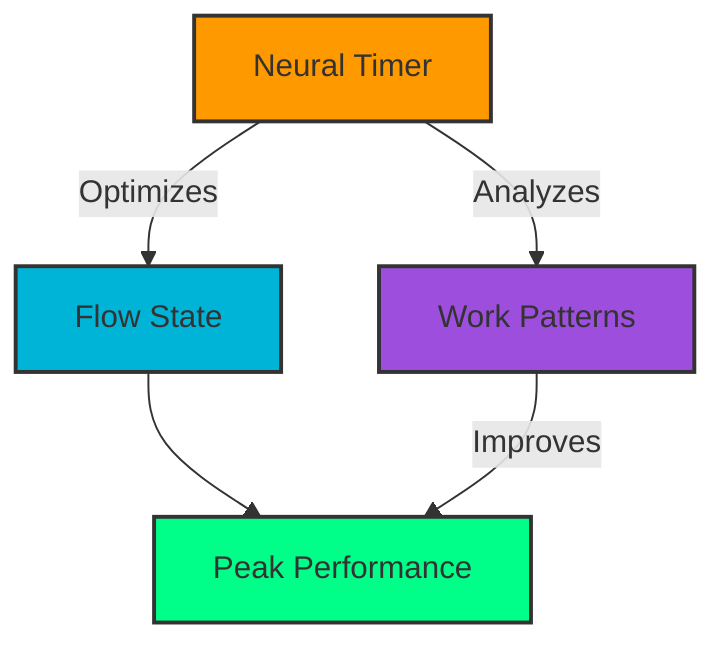
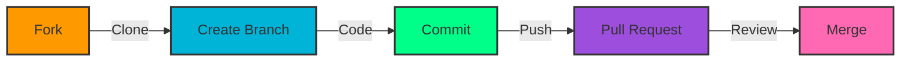

# 🚀 Coding Roadmap 2025

<div align="center">

[](https://github.com/KrishShukla07/Coding-Roadmap)
[](https://github.com/KrishShukla07/Coding-Roadmap)
[](LICENSE)
[](https://github.com/KrishShukla07)


### 🌟 Transforming Aspiring Coders into Industry-Ready Developers
#### Your AI-Powered Learning Companion for 2025 and Beyond

</div>

> "The future belongs to those who learn more skills and combine them in creative ways." - Robert Greene

An interactive, AI-enhanced web application designed for the modern tech landscape, offering a meticulously crafted 12-month journey from coding fundamentals to professional development.

## ⚡ Next-Gen Features

<div align="center">

| 🤖 AI-Enhanced Learning | 🌐 Industry Alignment | � Smart Progress Tracking |
|:----------------------:|:--------------------:|:-------------------------:|
| Adaptive learning paths | Real-time market insights | ML-powered skill analytics |
| Smart resource curation | 2025 salary projections | Interactive progress visualization |
| Personalized feedback | Emerging tech focus | Achievement system |

</div>

### 🎯 Core Features



- 🧠 **Smart Learning Path**: AI-optimized 6-phase roadmap
- 💼 **Career GPS**: ML-powered career trajectory mapping
- 🏆 **Live Hackathon Hub**: Real-time hackathon tracking & team matching
- 📚 **Knowledge Nexus**: AI-curated learning resources
- ⚡ **Flow State Timer**: Neural-enhanced productivity tools

## � Tech Arsenal

<div align="center">

```javascript
const techStack = {
    frontend: {
        core: ['HTML5', 'CSS3', 'JavaScript ES6+'],
        enhancement: ['PWA Architecture', 'Service Workers'],
        ui: ['Dynamic Themes', 'Neural UI Patterns']
    },
    features: {
        storage: 'IndexedDB + LocalStorage',
        offline: 'Advanced Caching Strategies',
        sync: 'Background Sync API'
    },
    performance: {
        loading: 'Dynamic Imports',
        rendering: 'Virtual DOM',
        optimization: 'Lighthouse CI'
    }
};
```

</div>

### 🌈 Progressive Enhancement
- 🚀 Zero to Hero Loading Strategy
- 🔄 Seamless Offline Experience
- 📱 Neural-Responsive Design
- 🎨 AI-Powered UI Adaptation
- 🔒 Future-Proof Security

## 📋 Learning Phases

1. **Python Foundation** (Months 1-2)
   - Python basics & VS Code setup
   - Core programming concepts
   - 50 HackerRank challenges
   - CLI project development

2. **C++ Development** (Months 3-4)
   - STL mastery
   - Sorting algorithms
   - 100 DSA problems
   - Bank Management System project

3. **Java & GitHub** (Months 5-6)
   - Object-Oriented Programming
   - Version Control with Git
   - GUI application development
   - Java certification prep

4. **Web Development** (Months 7-8)
   - HTML/CSS fundamentals
   - JavaScript ES6
   - React basics
   - Portfolio website project

5. **Projects & DSA** (Months 9-10)
   - Advanced algorithms
   - System design patterns
   - Full-stack development
   - Technical interview prep

6. **Specialization** (Months 11-12)
   - Track-specific learning
   - Specialized project work
   - Portfolio completion
   - Internship applications

## 🚀 Getting Started

1. Clone the repository:
   ```bash
   git clone https://github.com/KrishShukla07/Coding-Roadmap.git
   ```

2. Open `index.html` in your browser or use a local server:
   ```bash
   # Using Python
   python -m http.server 8000
   
   # Using Node.js
   npx serve
   ```

3. Start your learning journey! 🎉

## 🎯 Career Trajectory 2025

<div align="center">

### 🌟 Emerging Tech Pathways

| Career Track | Salary Range (2025) | Growth Potential | AI Integration |
|:------------:|:------------------:|:---------------:|:-------------:|
| Full-Stack Development | ₹8-25 LPA | 📈 High | 🤖 80% |
| Cloud Security | ₹12-35 LPA | 📈 Very High | 🤖 90% |
| AI/ML Engineering | ₹15-45 LPA | 📈 Exponential | 🤖 100% |

### ⚡ Productivity Amplifiers



#### 🧠 AI-Enhanced Tools
- 🎯 Neural Pomodoro Optimization
- 🔄 Dynamic Task Prioritization
- ⚡ Flow State Analytics
- 🌟 Performance Insights

</div>

## 🌐 Join the Innovation

<div align="center">

[](https://github.com/KrishShukla07/Coding-Roadmap/graphs/contributors)
[](https://github.com/KrishShukla07/Coding-Roadmap/pulls)
[](https://github.com/KrishShukla07/Coding-Roadmap/discussions)

</div>

### 🚀 Contribution Gateway



1. 🌟 Fork this universe
2. 🎯 `git checkout -b feature/NextGenFeature`
3. ✨ Innovate & commit: `git commit -m '🚀 Add quantum feature'`
4. 🔮 `git push origin feature/NextGenFeature`
5. 🌈 Open a Dimensional Pull Request

## 📝 License

This project is licensed under the MIT License - see the [LICENSE](LICENSE) file for details.

## 🙏 Acknowledgments

- [Python Documentation](https://docs.python.org/3/)
- [GeeksforGeeks](https://www.geeksforgeeks.org/)
- [MDN Web Docs](https://developer.mozilla.org/)
- [LeetCode](https://leetcode.com/)
- [HackerRank](https://www.hackerrank.com/)

## 🌌 Connect With The Future

<div align="center">

[](https://github.com/KrishShukla07)
[](https://linkedin.com/in/YourProfile)
[](https://twitter.com/YourProfile)

### 🌟 Join Our Neural Network

```javascript
const connect = {
    github: "Create an Issue or PR",
    discord: "Join our AI Learning Hub",
    email: "future@coding-roadmap.ai"
};
```

</div>

---
<div align="center">

### Made with 🤖 & ❤️ for the Tech Leaders of Tomorrow

[](https://github.com/KrishShukla07/Coding-Roadmap)

*"The best way to predict the future is to create it." - Peter Drucker*

</div>
